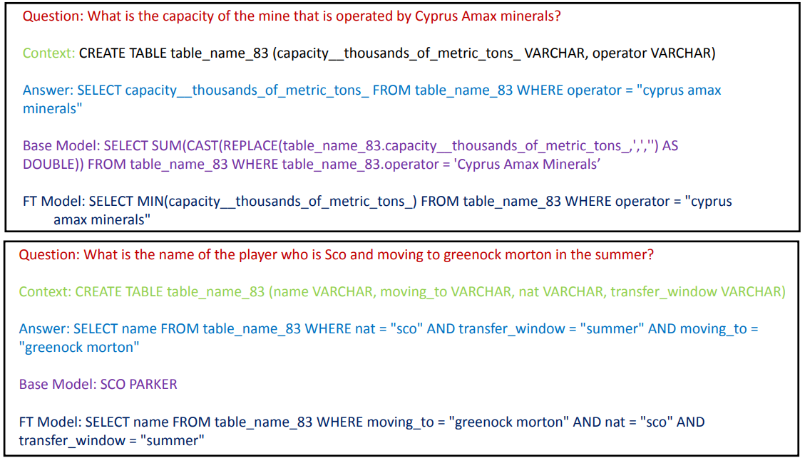

# Text2SQL

QA Sql to text conversion, this repo consists of text to sql 
training and inference scrips for llm based text to sql conversion. Model is trained on [Meta-llama-7B](https://huggingface.co/meta-llama/Llama-2-7b) and fine tuned using [PEFT](https://huggingface.co/docs/peft/en/index). More detailes can be found the [presentation](presentation/finetuning.pptx.pdf).


## usage:

Train the model on hugging face sql-create-context [b-mc2](https://huggingface.co/datasets/b-mc2/sql-create-context) using [Llama-7b (NousResearch)](https://huggingface.co/NousResearch/CodeLlama-7b-hf)

### Installation

```
pip install -r requirements.txt
```

### Train:
```
python train.py
```
Hyperparameters can be tuned in the script itself

### Inference:
```
python infer.py
```

## Some Results

<!-- <div align="center">
  
</div> -->

### Sample1

`Question: when deland is the fcsl team and 2008 is the year played who is the mlb team?
`

`Context: CREATE TABLE table_18373863_2 (mlb_team VARCHAR, years_played VARCHAR, fcsl_team VARCHAR)
`

`Answer: SELECT mlb_team FROM table_18373863_2 WHERE years_played = "2008" AND fcsl_team = "DeLand"
`

`Base Model: SELECT * FROM table_18373863_2 WHERE mlb_team = 'deland' AND years_played = '2008’; 
`

`FT Model: SELECT mlb_team FROM table_18373863_2 WHERE years_played = "2008" AND fcsl_team = "Deland" 
`

### Sample2

`Question: What is the capacity of the mine that is operated by Cyprus Amax minerals?
`

`Context: CREATE TABLE table_name_83 (capacity__thousands_of_metric_tons_ VARCHAR, operator VARCHAR)
`

`Answer: SELECT capacity__thousands_of_metric_tons_ FROM table_name_83 WHERE operator = "cyprus amax minerals"
`

`Base Model: SELECT SUM(CAST(REPLACE(table_name_83.capacity__thousands_of_metric_tons_,',','') AS DOUBLE)) FROM table_name_83 WHERE table_name_83.operator = 'Cyprus Amax Minerals’ 
`

`FT Model: SELECT MIN(capacity__thousands_of_metric_tons_) FROM table_name_83 WHERE operator = "cyprus amax minerals"`

Base Model: Result from bare bones Lama-7B model

FT Model: Result from Fine tuned model with dataset

## Ways to Make Better

- **Try out different LLMs**
  - LLaMA 70B, GPT-4, etc.

- **Make prompting better**
  - Explain to the context what each variable is and how tables are connected.

- **Datacentric approaches**
  - Use more SQL QA datasets with PEFT (Parameter Efficient Fine-Tuning).

- **Instruction-based datasets**

- **Reinforcement Learning with Human Feedback**
  - Rank the output and use human feedback to improve the model.

- **Customize loss functions**
  - Penalize for retrieving the incorrect query.

- **Use an interpreter to improve models**
  - Check the validity of the question to retrieve the correct data from the database.


## References

1.  [ Attention Is All You Need](https://proceedings.neurips.cc/paper_files/paper/2017/file/3f5ee243547dee91fbd053c1c4a845aa-Paper.pdf)

2.  [Training language models to follow instructions with human feedback](https://arxiv.org/pdf/2203.02155.pdf)

3.  [Understanding unsupervised learning](https://cameronrwolfe.substack.com/p/understanding-and-using-supervised)

4.  [Performance efficient fine tuning](https://abvijaykumar.medium.com/fine-tuning-llm-parameter-efficient-fine-tuning-peft-lora-qlora-part-1-571a472612c4)

5.  [Sql Create Context dataset](https://huggingface.co/datasets/b-mc2/sql-create-context)
